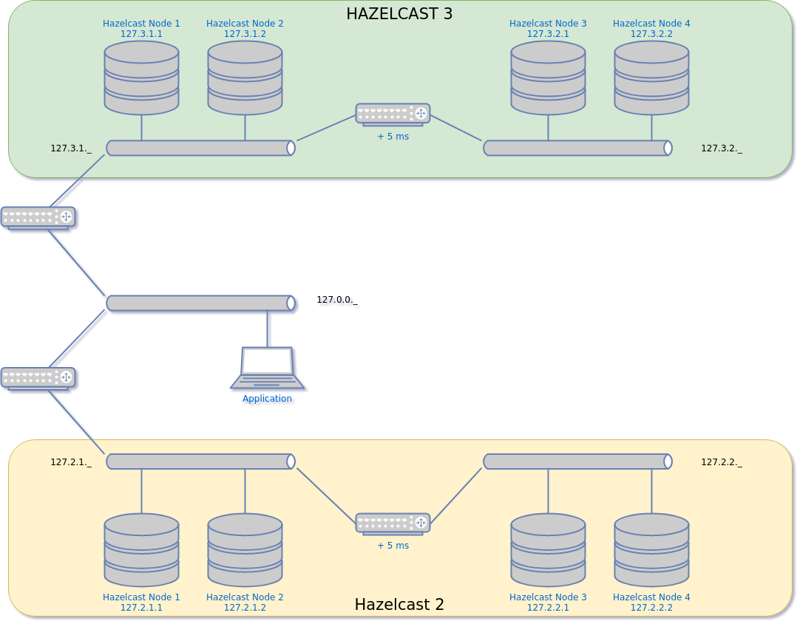

# Purpose

Assert which configuration should be put in place for Hazelcast to make the cluster resilient and stable.

# Findings

## Server

### 2.5

| variable                                       | default | recommended | meaning |
|---                                             |     ---:|         ---:|      ---|
| `hazelcast.heartbeat.interval.seconds`         |         |           5 |         |
|`hazelcast.max.no.heartbeat.seconds`            |         |          10 |         |
|`hazelcast.merge.first.run.delay.seconds`       |         |           5 |         |
|`hazelcast.merge.next.run.delay.seconds`        |         |           2 |         |
|`hazelcast.master.confirmation.interval.seconds`|         |          10 |         |
|`hazelcast.max.no.master.confirmation.seconds`  |         |          10 |         |
|`hazelcast.member.list.publish.interval.seconds`|         |           5 |         |

## Client

# Methodology for testing

## Simulation 

Several networks are in place:

Broadly speaking, those are the rules enforced:
* `127.0.0._` cannot communicate with `127.2.2._`
* `127.3._._` cannot communicate with `127.2._._`
* `127.2.1._` can communicate freely with `127.2.2._`
* `127.3.1._` can communicate freely with `127.3.2._`
* each packet going between `127.2.1._` and  `127.2.2._` is delayed by 5 ms, to simulate a remote site (a `ping` will then see a 10ms delay)
* each packet going between `127.3.1._` and  `127.3.2._` is delayed also by 5 ms

It will export a set of functions, and will print how to use them:

    $source start.sh
    23/10/2018 18:19:30 undoing previously setup things if any
    [sudo] password for a208220: 
    RTNETLINK answers: No such file or directory
    iptables: No chain/target/match by that name.
    iptables: No chain/target/match by that name.
    iptables: No chain/target/match by that name.
    iptables: No chain/target/match by that name.
    iptables: No chain/target/match by that name.
    iptables: No chain/target/match by that name.
    23/10/2018 18:19:33 setting up the new things
    #####################################################################
    usage: 
    tear    : reopens everything. You need a call to setup
              to use shut and open again

    setup   : prepare a set of rules to make shut and open
              to work as expected

    shut3, open3, split3, unsplit3 act on the 127.3.x.x nodes
    shut2, open2, split2, unsplit2 act on the 127.2.x.x nodes

    shut2 x : (x in 1..4) isolates node x

    open2 x : (x in 1..4) make nodes x reachable again, after they have
              sgut with the shut operation

    split2 t: nodes 3 and 4 are unreachable for time t.
              if t not given, split until 'unsplit' is called

    unsplit2: undoes a split (but does not undo a shut)

    status2 : gives state of nodes and intersite

    shut3, open3, split3, unsplit3 to act on the 127.3.x.x nodes

The rules are put in place when the script is sourced.

You can "undo" them (and hence allow communication between everyone undelayed) by issuing
`tear`, and redo all by issuing `setup`.

